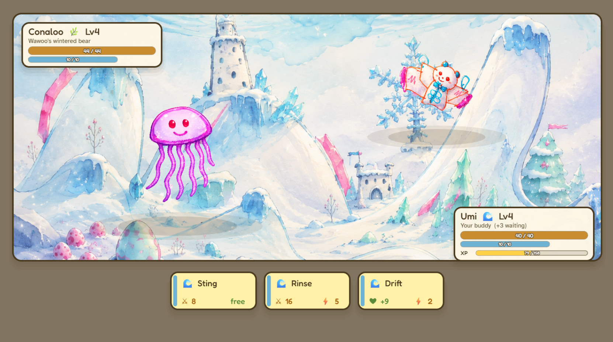
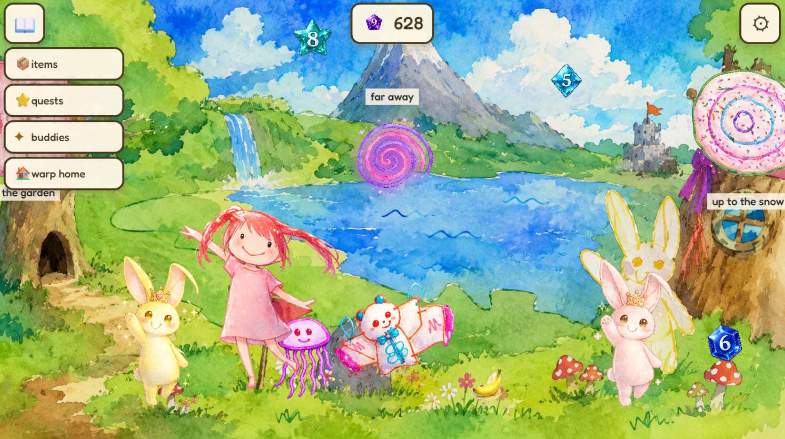
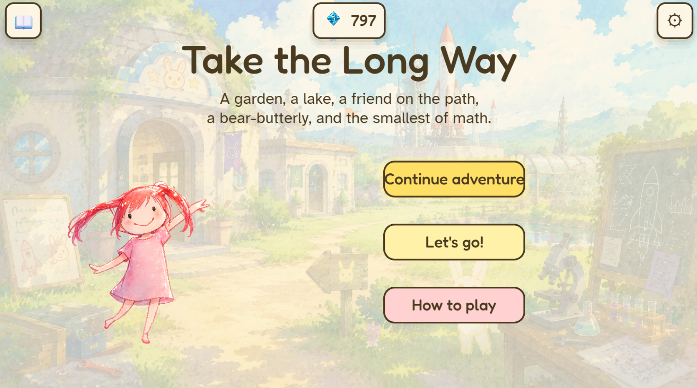

# Take the Long Way

*(also known as "Conaloo's Big Adventure" — the working title given by the
four-year-old who designed it)*

> A whimsical, rhyming, hand-drawn point-and-click software toy for a
> four-year-old. Built in Phaser 3 + Vite. Vanilla JS, no frameworks
> beyond Phaser.

### 🎮 [Play it now → conaloos-big-adventure.vercel.app](https://conaloos-big-adventure.vercel.app/)







---

## What it is

A small browser game made by a parent and his four-year-old daughter.
The four-year-old draws every character, picks the names, and is the
lead playtester. She's also the lead artist for backgrounds, items,
and portals — everything on screen is something she's drawn or
suggested.

A few things that make it *not* a normal game:

- **No fail states.** You can't get stuck. You can't lose. Every click
  rewards.
- **Dr Seuss / A. A. Milne energy.** Every line of dialogue scans —
  anapestic meter, true rhymes, gentle wonder. Read aloud, it's a
  picture book.
- **Edutainment by stealth.** A character mentions something true and
  interesting; the kid learns without noticing.
- **Pokémon-style buddy battles.** Tap an NPC's buddy to challenge
  them; turn-based combat with HP bars, energy, type advantages.

## Quick start

```bash
npm install
npm run dev          # local dev server at http://localhost:5173
npm run build        # production build to /dist
npm run preview      # serve the production build locally
npm run check-coverage  # report asset usage
```

The first time you `dev`, the manifest plugin walks `/assets/`,
parses filenames, and writes `/src/content/manifest.json`. Adding a
file to `/assets/` while `dev` is running rebuilds the manifest on
the fly.

## Where to start

**Humans:**
1. `GDD.md` — what we're building, and why.
2. `SPEC.md` — how it's wired together.
3. `docs/CHANGELOG.md` — what's shipped, latest first.

**Agents** (yes, even another instance of you):
- `CLAUDE.md` first, every session. It tells you the priority order
  and house style.

## Asset contract

All assets live in `/assets/`. Drop everything in flat — the loader
walks recursively but a flat folder is fine. Filename conventions are
the source of truth:

| Pattern | Example |
|---|---|
| `peep_{name}_{gender}_{age}.png` | `peep_amelia_F_4.png` |
| `animal_{name}_{species}.png` | `animal_conaloo_bear-butterly.png` |
| `bg_{description}.png` | `bg_sunny-rocket-garden.png` |
| `thing_{name}.png` | `thing_teddybear.png` |
| `portal_{name}.png` | `portal_heart_door.png` |
| `gem_{n}.png` (also `gem_{n}_glowing.png`) | `gem_3.png` |
| `music_{tone}.{mp3,ogg,wav}` | `music_calm.mp3` |
| `sfx_{name}.{mp3,ogg,wav}` | `sfx_pop.mp3` |

Underscores separate fields; hyphens are for multi-word descriptions.
Files that don't match are logged and skipped.

## Layout

```
/assets                 ← drop everything here, flat is fine
/src
  main.js               ← bootstrap
  /scenes
    BootScene.js        ← asset preload
    WaitingScene.js     ← placeholder if /assets/ is empty
    TitleScene.js       ← the title card
    TutorialScene.js    ← "how to play" page
    GameScene.js        ← every gameplay scene runs through this
    BattleScene.js      ← buddy-battle overlay
  /systems
    AssetLoader.js      ← turns the manifest into Phaser textures
    HotspotManager.js   ← clickable hotspots + responses + quizzes
    DialogueBox.js      ← speech bubbles with tails
    QuizDialog.js       ← the multiple-choice quiz UI
    SaveGame.js         ← localStorage persistence
    BuddyTeam.js        ← buddy roster + level-ups
    GemBag.js           ← currency
    Quests.js           ← quest definitions + tracker
    GemHUD.js, Inventory.js, QuestHUD.js, GlobalUI.js
                        ← persistent top-level HUDs
    UITokens.js         ← shared design tokens
    Protagonist.js      ← Amelia's walk system
    AudioManager.js, SceneRouter.js, Accessibility.js
  /content
    scenes.js           ← hand-authored scene defs
    characters.js       ← character bios + dialogue pools
    lines.js            ← shared rhyme pool (themed fallback)
    quizzes.js          ← per-character quizzes
    buddySpecies.js     ← buddy stats + moves
    typeChart.js        ← buddy-type advantage chart
    inventoryReactions.js
    sfxPools.js         ← per-character SFX pools
    sceneCatalog.js     ← merges hand-authored + auto scenes
    autoScene.js        ← fallback scene generator
    manifest.json       ← generated at build time, gitignored
  /plugins
    manifestPlugin.js   ← Vite plugin that walks /assets/
/scripts
  check-coverage.js     ← which assets are used vs. unused
/docs
  CHANGELOG.md          ← shipped releases, newest first
  TODO.md               ← roadmap + parked ideas
  BUDDY_DESIGN.md       ← full spec for the buddy battle system
  WRITING_STYLE.md, HOTSPOT_PATTERNS.md, THEME_COVERAGE.md,
  PLAYTEST_NOTES.md
  /scenes               ← per-scene design notes
  /characters           ← per-character design notes
  /screenshots          ← README/marketing screenshots
/openspec               ← spec-driven change proposals (see openspec --help)
```

## What ships even with no assets yet

`/src/scenes/WaitingScene.js` is shown when `/assets/` has no
backgrounds. As soon as a `bg_*.png` lands, the game switches to it.
For each background that doesn't yet have a hand-written entry in
`/src/content/scenes.js`, `/src/content/autoScene.js` builds a generic
scene with character / thing placement, hotspot zones, and lines from
the themed rhyme pool. So new backgrounds are always playable — even
before the agent has written bespoke verse.

## Deploy

`npm run build` writes a static `/dist/`. Currently deployed to
Vercel at the URL at the top of this file; the same build drops onto
Netlify or GitHub Pages without changes (set `BASE_PATH` env var for
the latter).
